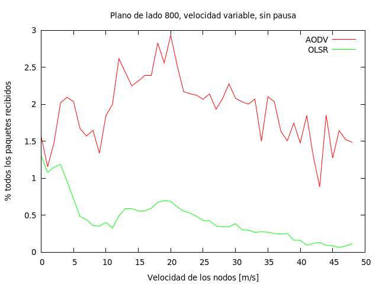
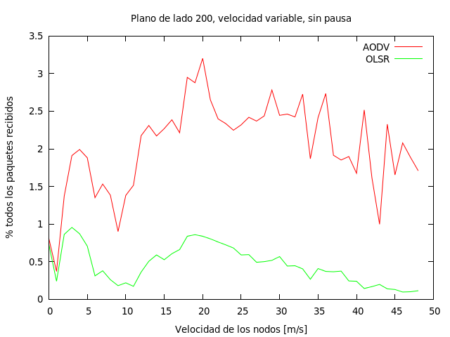

Redes moviles Ad-hoc
Manuel Ferreria
Informe
--------------------

Cambios realizados
------------------

Metodologia de experimentacion
------------------------------

Para realizar el analisis de performance de los distintos protocolos de enrutamiento
primero armamos un framework de pruebas. En este caso, es un script (*runExperiment.sh*)
que se encarga de correr ambos protocolos usando la misma disposicion inicial de nodos
y movimientos y capturar las salidas en archivos apropiados. Esto se hace fijando
la semilla del RNG de cada corrida de modo que se pueda recrear todos los mismos
movimientos de los nodos usando las mismas posiciones iniciales (por semilla).

Parametros
---------

Hemos fijado en 50 nodos la cantidad que vamos a utilizar para los analisis, al ser
este un numero no trivial de nodos que interactuen. A su vez, mantendremos las
asignaciones de tareas que se plantearon en la guia orientativa, donde los nodos
0 a 9 recibien mensajes de los nodos 10 a 19, y los demas solo sirven en la red para
retransmitir.

Para cambiar la densidad de los nodos, cambiamos el tama\~no del bounding box
que los contiene. Para hacer eso, debemos alterar los metodos que inicializan
el ObjectFactory. Para simplificar el problema, nos importaran solamente
cuadrados, no rectangulos.

Definimos como red poco densa al cuadrado de lado 800 y como red muy densa
al cuadrado de lado 200.

Para cambiar la movilidad de los nodos, podemos alterar dos parametros del modelo.
Estos son, nodeSpeed y nodePause. Segun el modelo de RandomWaypoint, ambos
determinan el comportamiento de los nodos con respecto a su posicion en el
espacio (en nuestro caso, el plano Z-0). La velocidad del nodo altera el tiempo
que el nodo va a estar desplazandose hacia un punto elegido aleatoriamente;
la pausa es el tiempo que va a esperar al llegar a destino hasta empezar a
desplazarse nuevamente.

Estudiaremos el problema fijando la pausa en 1s y variando la velocidad de los
nodos desde 1m/s (velocidad de un ser humano caminando) hasta 50m/s
(por ejemplo, automoviles).

Metricas
--------

Las metricas que nos van a interesar obtener de las simulaciones, para
luego evaluar la performance van a ser:

- % de paquetes recibidos
- Cantidad de paquetes recibidos por algun nodo

Para medir el porcentaje de paquetes recibidos, vamos a contabilizar
la recepcion sobre el total de paquetes emitidos. Es decir:

Pct = Sum(Cant_msjs_recibidos_nodo) /  (Cant_nodos_emitiendo * Cant_mensajes_emitidos)

donde Cant_mensajes_emitidos lo calculamos poniendo el logging de onoffapplication en nivel
info, para poder ver el instante donde se envia un mensaje entre nodos (y no los rebroadcasteos).

Experimentos
------------

Para medir el % de paquetes recibidos entre los dos protocolos, vamos a probar
hacerlo variando tanto la movilidad como la densidad (independientemente).

Aca comparamos el % de paquetes recibidos moviendo la velocidad de los nodos entre 1 y 49m/s.
Para eso, usamos el script runExperiment.sh, que corre variando la velocidad entre 1 y 49, y para
cada velocidad varia la seed entre 1 y 100 del RNG para poder repetir los mismos movimientos. Ademas,
fijamos la densidad de los nodos en  50 nodos en una box de 800x800.

Luego contamos del log general todos los mensajes que fueron enviados por cada ip y los mensajes
que fueron recibidos. Finalmente, los sumamos a todos entre si (es decir, por cada velocidad,
sumamos todos los mensajes recibidos de todas las corridas y lo dividimos por todos los
mensajes enviados en todas las corridas). Con eso sacamos el % promedio de paquetes recibidos
por cada velocidad. Esto lo corremos tanto con AODV y con OLSR y comparamos ambos porcentajes
de paquetes recibidos.

Una cuestion para remarcar, es que aca estamos mirando los paquetes enviados por on-off,
por lo cual nos omitimos los problemas que ocasionaria en las mediciones si estuvieramos
hookeados a una capa mas abajo (como UDP).

Repetimos aca la misma metodologia pero usando una red muy densa, de 200x200.

