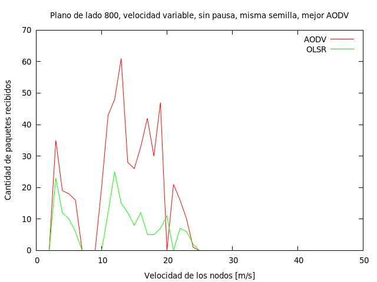

Redes moviles Ad-hoc - ECI 2014 - Informe
--------------------

Metodologia de experimentacion
------------------------------

Para realizar el analisis de performance de los distintos protocolos de enrutamiento
primero armamos un framework de pruebas. En este caso, es un par de scripts en shell
(*runExperiment.sh* y *runExperiment_pernode.sh*)
que se encargan de correr ambos protocolos usando la misma disposicion inicial de nodos
y movimientos y capturar las salidas en archivos apropiados. Esto se hace fijando
la semilla del RNG de cada corrida de modo que se pueda recrear todos los mismos
movimientos de los nodos usando las mismas posiciones iniciales (por semilla).

Parametros
---------

Hemos fijado en 50 nodos la cantidad que vamos a utilizar para los analisis, al ser
este un numero no trivial de nodos que interactuen. A su vez, mantendremos las
asignaciones de tareas que se plantearon en la guia orientativa, donde los nodos
0 a 9 recibien mensajes de los nodos 10 a 19, y los demas solo sirven en la red para
retransmitir.

Para cambiar la densidad de los nodos, cambiamos el tama\~no del bounding box
que los contiene. Para hacer eso, debemos alterar los metodos que inicializan
el ObjectFactory. Para simplificar el problema, nos importaran solamente
cuadrados, no rectangulos.

Definimos como red poco densa al cuadrado de lado 800 y como red muy densa
al cuadrado de lado 200.

Para cambiar la movilidad de los nodos, podemos alterar dos parametros del modelo.
Estos son, nodeSpeed y nodePause. Segun el modelo de RandomWaypoint, ambos
determinan el comportamiento de los nodos con respecto a su posicion en el
espacio (en nuestro caso, el plano Z-0). La velocidad del nodo altera el tiempo
que el nodo va a estar desplazandose hacia un punto elegido aleatoriamente;
la pausa es el tiempo que va a esperar al llegar a destino hasta empezar a
desplazarse nuevamente.

Estudiaremos el problema fijando la pausa en 0s y variando la velocidad de los
nodos desde 1m/s (velocidad de un ser humano caminando) hasta 50m/s
(por ejemplo, automoviles).

Metricas
--------

Las metricas que nos van a interesar obtener de las simulaciones, para
luego evaluar la performance van a ser:

- % de paquetes recibidos
- Cantidad de paquetes recibidos por algun nodo

Para medir el porcentaje de paquetes recibidos, vamos a contabilizar
la recepcion sobre el total de paquetes emitidos. Es decir:

Pct = Sum(Cant_msjs_recibidos_nodo) /  (Cant_nodos_emitiendo * Cant_mensajes_emitidos)

donde Cant_mensajes_emitidos lo calculamos poniendo el logging de onoffapplication en nivel
info, para poder ver el instante donde se envia un mensaje entre nodos (y no los rebroadcasteos).

Experimentos
------------

Para medir el % de paquetes recibidos entre los dos protocolos, vamos a probar
hacerlo variando tanto la movilidad como la densidad (independientemente).

Aca comparamos el % de paquetes recibidos moviendo la velocidad de los nodos entre 1 y 49m/s.
Para eso, usamos el script runExperiment.sh, que corre variando la velocidad entre 1 y 49, y para
cada velocidad varia la seed entre 1 y 100 del RNG para poder repetir los mismos movimientos. Ademas,
fijamos la densidad de los nodos en  50 nodos en una box de 800x800.

Luego contamos del log general todos los mensajes que fueron enviados por cada ip y los mensajes
que fueron recibidos. Finalmente, los sumamos a todos entre si (es decir, por cada velocidad,
sumamos todos los mensajes recibidos de todas las corridas y lo dividimos por todos los
mensajes enviados en todas las corridas). Con eso sacamos el % promedio de paquetes recibidos
por cada velocidad. Esto lo corremos tanto con AODV y con OLSR y comparamos ambos porcentajes
de paquetes recibidos.

Una cuestion para remarcar, es que aca estamos mirando los paquetes enviados por la aplicacion
on-off, por lo cual nos omitimos los problemas que ocasionaria en las mediciones si
estuvieramos hookeados a una capa mas abajo (como UDP).

Repetimos aca la misma metodologia pero usando una red muy densa, de 200x200.

Otro experimento interesante es, dado una misma semilla del RNG, ver como se
comporta algun nodo variando la velocidad a la que se mueva. De esta manera
podemos ver como se comporta para un solo nodo los dos protocolos en funcion
de la velocidad (ya que mantenemos la topologia de la red estable al no variar
la semilla).

Vamos a tomar como comparacion el mejor caso de AODV comparado contra el mismo de OLSR,
y luego comprararemos el mejor de OLSR contra el mismo de AODV.
Tomamos un caso de un nodo que tiene un alto porcentaje de exitos de recepcion de
mensajes. Vamos a fijar la semila = 8, con la caja de 800x800, mirando el nodo
10.1.1.3.

Ahora comparamos contra el nodo 10.1.1.9 en la corrida de semilla = 9, con el mismo
tamanio de caja, 800x800.

Conclusiones
------------

En estos experimentos comprobamos como se comportan en MANETs de distintos tipos
estos dos protocolos.

En los graficos 1 y 2, obtuvimos el promedio de paquetes recibidos en 100 corridas.
Es posible observar una importante mejoria en el porcentaje de recepcion usando AODV.
Tambien se puede notar que tener una gran movilidad es un factor de complicaciones
en las comunicaciones. Estos protocolos son de proposito general en las MANETs, por
lo cual en casos normales de comunicacion andan razonablemente bien, pero en altas
velocidades promedio de los nodos tienen fallas. Podemos ver que a velocidades de peatones
y ciclistas (abajo de 20 metros por segundo) se comportan razonablemente bien (un
poco mejor en la red mas densa, como era de esperar). Pero en cuanto aumenta mas la
velocidad de los nodos, ya las comunicaciones pierden muchos mas paquetes. Es muy
complicado mantener rutas en entornos tan dinamicos. OLSR en este caso es claramente
el peor de los protocolos; con mucho dinamismo en la red las rutas estaticas generadas
proactivamente por el broadcasting no son ideales. AODV en cambio tiene mucho mejor
comportamiento, al ser mucho mas adaptable en estos casos.
Una potencial mejoria para el caso de OLSR seria tener en cuenta la velocidad de los
nodos a la hora de enviar. Si se pudiera considerar en la capa L2-L3 estos detalles
del sistema, se podria ajustar el envio de beacons a parametros mas optimos.
En redes muy dinamicas se podria hacer mas frecuentemente (a riesgo de aumentar el
ruido de la red), y en redes mas estaticas se podria hacer menos frecuentemente (a riesgo
de tener rutas potencialmente obsoletas mas seguido).

En los graficos 3 y 4, podemos ver el comportamiento de la recepcion de un nodo corrido
con una semilla en particular. Este experimento sirve para ver cuantos paquetes recibidos
tiene un nodo en un sistema que realizan siempre los mismos recorridos. De esta manera,
con la misma topologia de fondo de la red y los mismos movimientos y variando la
velocidad de los nodos, podemos recrear el comportamiento de los nodos solamente
cambiendo el protocolo de routeo.
Nuevamente aqui observamos el mejor comportamiento de AODV por sobre OLSR. En esta simulacion
tomamos el nodo con mas paquetes recibidos en AODV y lo comparamos contra el mismo
pero corriendo en OLSR, y viceversa. Cabe notar que no es el mismo nodo ni la misma
semilla del RNG, por lo cual podemos apreciar que el protocolo de enrutamiento OLSR
puede ser mas eficaz en algunas condiciones. Sin embargo, aca comparando el mejor
de cada uno contra el otro, es todavia muy significativo como para casi todas las velocidades
AODV se comporta de mejor manera que OLSR, teniendo una tasa de recepcion significativamente
mayor.
Se puede notar tambien que ambos graficos presentan un corte en cierto punto;
ahi es cuandos los grafos de conexion se separan y ya no pueden enviarse mensajes.
Es decir, por las trayectorias del sistema a esa velocidad, no llegan a enviarse ni un mensaje.

De mas esta decir que estos resultados tienen muchas mas variables de fondo que las
estudiadas aqui. En un potencial trabajo futuro se podrian tambien analizar temas
de delay de los paquetes, del jitter existente si se usan multiples rutas, del
throughput de las comunicaciones. Tambien se podria evaluar con redes mucho mas
saturadas pero mas estables en posiciones, donde seguramente los protocolos como
OLSR (proactivos) que arman una topologia de la red mas organizada tendran mejores
resultados de performance y perdida de paquetes.

